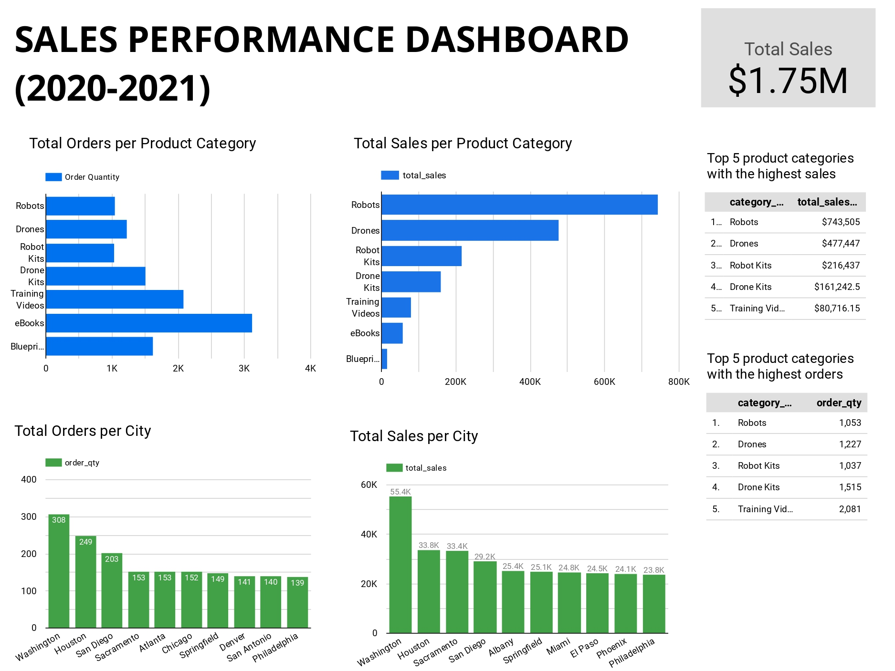

Sebagai BI Analyst PT Sejahtera Bersama, saya diminta untuk membuat report terkait Performa Penjualan Tahun 2020-2021.

# Data Used
Dataset - [Dataset-Task.zip](https://drive.google.com/file/d/1RwsBQ1FriNfz6qiq0V5nD7gF7jO81To3/view)  
Data Cleaning - Microsoft Excel  
Data Visualization - Looker Studio

# Key Questions
- Berapa total penjualan secara keseluruhan?
- Berapa total penjualan berdasarkan kategori produk?
- Berapa total order berdasarkan kategori produk?
- Berapa total penjualan berdasarkan kota?
- Berapa total order berdasarkan kota?
- Produk apa saja yang memiliki total penjualan tertinggi?
- Produk apa saja yang memiliki total order tertinggi?

# Result

Dari dashboard penjualan tersebut dapat dilihat bahwa perusahaan secara keseluruhan memperoleh total sales sebanyak USD **1,75 Juta** selama periode tahun 2020-2021. 
Kategori produk dengan total sales tertinggi berada pada kategori **Robots**, sedangkan total orders tertinggi berada pada kategori **eBooks**. 
Sementara itu, **Washington** menjadi kota dengan total sales sekaligus total orders tertinggi dibandingkan kota-kota lainnya.

